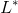

# Affect dynamics with  and 

This respository contains a Python module for running numerical experiments on the  and  statistics for affect dynamics.

# Requirements

The module requires NumPy and has been tested on Python 3.7.

# Usage

The module contains functions for, among other things, computing  and  values, and running numerical experiments.  The default parameters of the `base_rate_analysis` function execute experiment 1, while the parameters for experiment 2 are contained in the docstring.